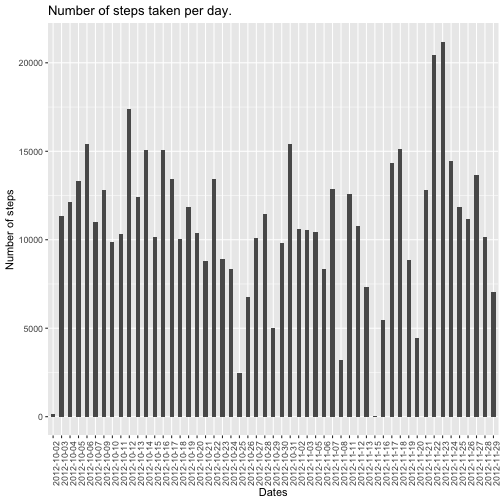
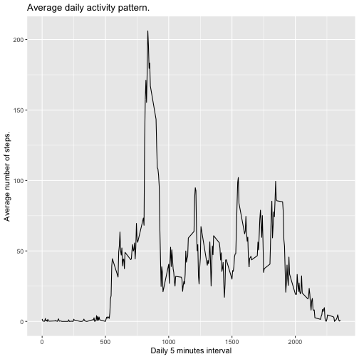
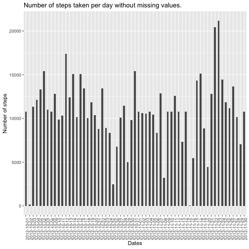
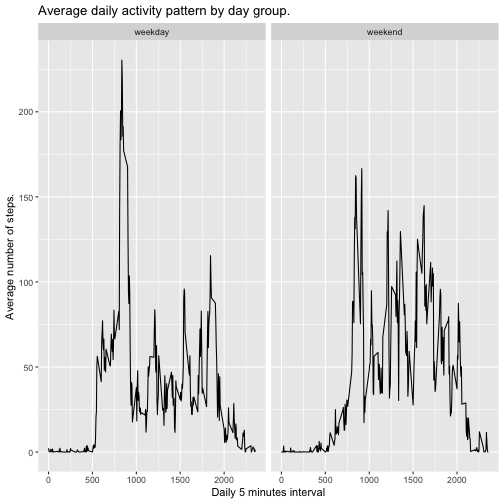

## Loading and preprocessing the data

We unzip the *activity.zip* file into the current directory to extract the *activity.csv* file.  
Then, we read the *.csv* file and store the result in a variable named *activity*.


```r
unzip("activity.zip")
activity <- read.csv("activity.csv")
```

## What is mean total number of steps taken per day?

We use the *dplyr* package to group the data by date and then to calculate the number of steps taken per day.


```r
library(dplyr)

steps_per_day <- activity %>%
    select(steps, date) %>%
    filter(!is.na(steps)) %>%
    group_by(date) %>%
    summarise_all(sum, na.rm = TRUE)
```

We use *ggplot2* package to diplay the number of steps taken per day.


```r
library(ggplot2)

ggplot(steps_per_day) +
    geom_bar(mapping = aes(date, steps), stat = "identity", width=0.5) +
    theme(axis.text.x = element_text(angle = 90, hjust = 1)) +
    labs(title = "Number of steps taken per day.") +
    labs(x = "Dates") +
    labs(y = "Number of steps")
```



Finally, we calculate both the mean and the median of the total number of steps taken per day.

To calculate the mean:


```r
mean(steps_per_day$steps)
```

```
## [1] 10766.19
```

To calculate the median:


```r
median(steps_per_day$steps)
```

```
## [1] 10765
```

## What is the average daily activity pattern?

We use the *dplyr* package to group the data by interval and then to calculate the average number of steps taken.


```r
library(dplyr)

daily_activity_pattern <- activity %>%
    select(steps, interval) %>%
    filter(!is.na(steps)) %>%
    group_by(interval) %>%
    summarise_all(list(steps_avg=mean), na.rm = TRUE)
```

We use *ggplot2* package to diplay the average number of steps taken, averaged across all days (y-axis).


```r
library(ggplot2)

ggplot(daily_activity_pattern) +
    geom_line(mapping=aes(interval, steps_avg)) +
    labs(title = "Average daily activity pattern.") +
    labs(x = "Daily 5 minutes interval") +
    labs(y = "Average number of steps.")
```



Finally, we use *dplyr* package to identify the 5-minute interval, on average across all the days in the dataset, that contain the maximum number of steps.


```r
library(dplyr)

interval_max_steps_avg <- daily_activity_pattern %>%
    filter(steps_avg == max(steps_avg)) %>%
    select(interval)

as.character(interval_max_steps_avg)
```

```
## [1] "835"
```

## Imputing missing values

We calculate the number of missing values in the *activity* dataset.


```r
missing_values <- data.frame()

for (name in names(activity)) {
    missing_values <- rbind(
        missing_values,
        data.frame("column_name" = name, "number_missing_values" = sum(is.na(activity[[name]]))))
}

knitr::kable(missing_values, caption = 'Number of missing values in the activity dataset.')
```


|column_name | number_missing_values|
|:-----------|---------------------:|
|steps       |                  2304|
|date        |                     0|
|interval    |                     0|

Then, as the *steps* column is the only one with missing values, we fill them using the mean for the corresponding 5-minute interval.


```r
activity_no_missing_values <- data.frame(activity)

for (i in 1:nrow(activity_no_missing_values)) {
    interval <- activity_no_missing_values[i, "interval"]
    steps <- activity_no_missing_values[i, "steps"]

    if (is.na(steps)) {
        interval_idx <- daily_activity_pattern$interval == interval
        steps_avg <- daily_activity_pattern[interval_idx, "steps_avg"]
        activity_no_missing_values[i, "steps"] <- steps_avg
    }
}
```

We use the *dplyr* package to group the data by date and then to calculate the number of steps taken per day.


```r
steps_per_day_no_missing_values <- activity_no_missing_values %>%
    select(steps, date) %>%
    filter(!is.na(steps)) %>%
    group_by(date) %>%
    summarise_all(sum, na.rm = TRUE)
```

We use *ggplot2* package to diplay the number of steps taken per day.


```r
library(ggplot2)

ggplot(steps_per_day_no_missing_values) +
    geom_bar(mapping = aes(date, steps), stat = "identity", width=0.5) +
    theme(axis.text.x = element_text(angle = 90, hjust = 1)) +
    labs(title = "Number of steps taken per day without missing values.") +
    labs(x = "Dates") +
    labs(y = "Number of steps")
```



Finally, we calculate both the mean and the median of the total number of steps taken per day.

To calculate the mean:


```r
mean(steps_per_day_no_missing_values$steps)
```

```
## [1] 10766.19
```

To calculate the median:


```r
median(steps_per_day_no_missing_values$steps)
```

```
## [1] 10766.19
```

The difference between these values and the ones we obtained by eliminating the rows with missing values only affects the *median* but not the *mean*.  
So, for this particular case, imputing missing data produces no impact on the total daily number of steps. This is because we used the mean for the corresponding 5-minute interval which doesn't affect to the mean calculation.

## Are there differences in activity patterns between weekdays and weekends?

We create a new factor variable in the dataset with two levels – “weekday” and “weekend” indicating whether a given date is a weekday or weekend day.


```r
date_to_day_group <- function(date) {
    week_days <- c("Mon", "Tue", "Wed", "Thu", "Fri")

    if (weekdays(strptime(date, "%Y-%m-%d"), abbr=TRUE) %in% week_days) {
        day_group <- "weekday"
    } else {
        day_group <- "weekend"
    }

    day_group
}

activity_no_missing_values$day_group <- sapply(activity_no_missing_values$date, date_to_day_group)
```

We use the *dplyr* package to group the data by interval and then to calculate the average number of steps taken across all weekday days or weekend days.


```r
library(dplyr)

daily_activity_pattern_by_day_group <- activity_no_missing_values %>%
    select(steps, interval, day_group) %>%
    filter(!is.na(steps)) %>%
    group_by(day_group, interval) %>%
    summarise_all(list(steps_avg=mean), na.rm = TRUE)
```

We use *ggplot2* package to diplay the 5-minute interval (x-axis) and the average number of steps taken, averaged across all weekday days or weekend days (y-axis).


```r
library(ggplot2)

ggplot(daily_activity_pattern_by_day_group) +
    geom_line(mapping=aes(interval, steps_avg)) +
    facet_wrap(~ day_group) +
    labs(title = "Average daily activity pattern by day group.") +
    labs(x = "Daily 5 minutes interval") +
    labs(y = "Average number of steps.")
```


